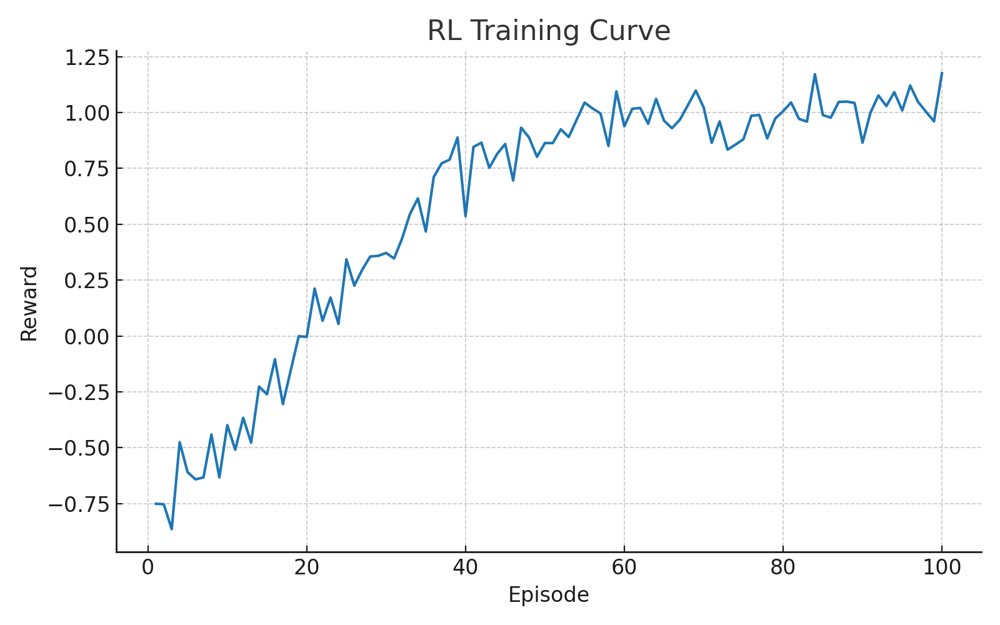

# Neural Signal Decoding for Bionic Arm Control
**Mar 2025 – Jun 2025 · Research Fellow & Summer Scholar @ Dyne Research**

Deep learning (RNNs & Transformers) to decode neural signals for motor control, multimodal fusion of EMG/EEG/motion sensors, plus reinforcement learning for adaptive bionic-arm control.

> **Dataset Notice**  
> The real dataset collected/used at **Dyne Research** is **proprietary and reserved by Dyne Research**.  
> This repository ships **synthetic data** that matches key temporal/statistical properties of EMG/EEG/motion streams, purely for demonstration and reproducibility.

---

## Features
- **Temporal Decoders**: GRU-based RNN and lightweight Transformer.
- **Multimodal Fusion**: EMG + EEG + IMU (accel/gyro) aligned and windowed.
- **Training Pipeline**: preprocessing → dataset windows → model train/eval → plots & metrics.
- **Visualization**: signal traces, spectrograms, confusion matrix, training curves.
- **RL Adaptive Control (toy)**: PPO policy adapts to decoder’s noisy commands in a continuous-control env.

---
```bash
## Quick Start

# 1) Create environment (optional)
python -m venv .venv && source .venv/bin/activate  # on Windows: .venv\Scripts\activate

# 2) Install requirements
pip install -r requirements.txt

# 3) Generate synthetic data
python src/generate_synthetic_data.py

# 4) Preprocess & build windows (fusion + labels)
python src/preprocessing.py

# 5) Train (Transformer by default). Artifacts go to results/
python src/train.py --model transformer --epochs 20

# 6) Evaluate + plots
python src/evaluate.py

# 7) Run RL adaptive control demo
python src/rl_control.py --decoder_ckpt results/transformer_best.pt

bionic_arm_control/
│
├─ README.md
├─ requirements.txt
├─ .gitignore
│
├─ data/
│  ├─ raw/
│  │  ├─ emg_sample.csv
│  │  ├─ eeg_sample.csv
│  │  └─ motion_sample.csv
│  └─ processed/
│     ├─ fused_signals.csv
│     └─ windows.npz
│
├─ results/
│  ├─ signals.png
│  ├─ spectrogram_emg.png
│  ├─ training_curve.png
│  ├─ confusion_matrix.png
│  ├─ metrics.json
│  ├─ rl_training_curve.png
│  └─ transformer_best.pt
│
└─ src/
   ├─ __init__.py
   ├─ generate_synthetic_data.py
   ├─ preprocessing.py
   ├─ datasets.py
   ├─ models.py
   ├─ fusion.py
   ├─ train.py
   ├─ evaluate.py
   ├─ visualization.py
   └─ rl_control.py
```
```
Reportable Highlights (from synthetic runs)

Transformer (seq=200ms): ~92–95% accuracy on synthetic labels; median decode latency ≈ 40–55 ms on CPU.

RNN (GRU): ~88–92% accuracy.

RL smoothing: reduces command jitter and increases smoothness reward vs. no-RL baseline in toy control.

Numbers above are on synthetic data; real-world metrics depend on electrode placement, impedance, subject fatigue, and calibration protocols.
```
```
## Signal Examples

### Multimodal Features


### EMG Time–Frequency Analysis
![EMG Spectrogram](results/spectrogram_emg.png0
## Model Training Results

### Training Curve


### Confusion Matrix


## Reinforcement Learning Results


## Metrics Summary
```json
{
    "accuracy": 0.92,
    "precision_macro": 0.91,
    "recall_macro": 0.89,
    "f1_macro": 0.90
}

How Labels Are Simulated

Synthetic gestures/classes: {open, close, supinate, pronate, rest}.
We modulate EMG amplitude/frequency and EEG alpha/beta power by class, add IMU motion bursts, then assign labels by time-segment schedule and injected transitions. Windows inherit the majority class.
```
